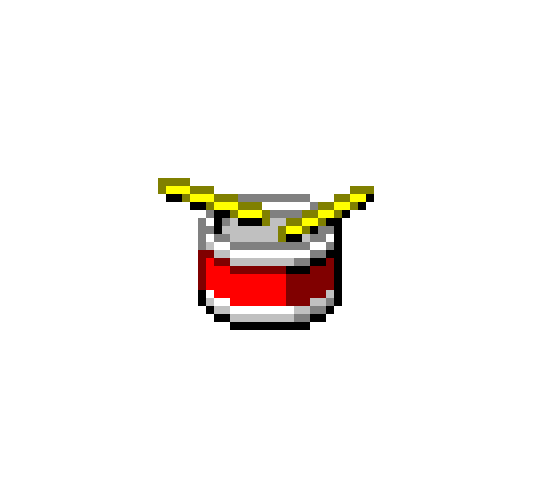
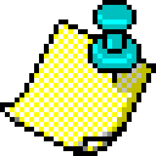

<h1 align="center">Hey there </h1>

My name is Robert Rybczynski, I'm a full-stack developer based in London, with a mind set on pursuing the depth of web development. Working mostly with React, but constantly learning new technologies and exploring new projects. Part-time traveler, adventurer and philosophy enthusiast

<a href="https://www.linkedin.com/in/robert-rybczynski-a86187a0/"></img></a>

  <h1>Technologies</h1>
    

# Programming languages
  

  
  
  
   

    
# Frontend
  

  
  
  
  
   

  
# Backend
  

  
  
  
  
  
  
  

<h1 align="center">Checkout my latest project: </h1>

<a href="https://rubberduckit.netlify.app/" align="center"> Rubber-Duck  <a href="https://github.com/Rob4ert/Rubber-Duck" align="center">GitHub repo</a></a>
  

